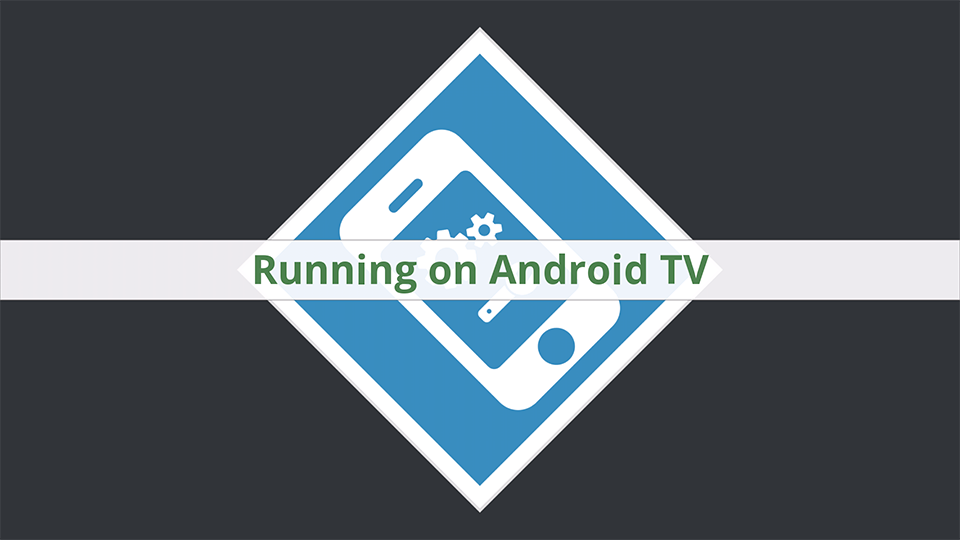

# Android TV OpenFL Example

This is an example application to demonstrate what you need to do to make your OpenFL game working on an Android TV with leanback launcher banner and realtime platform checking.

Read more about it in [this blogpost](http://spip.nl/making-your-openfl-game-android-tv-ready).
